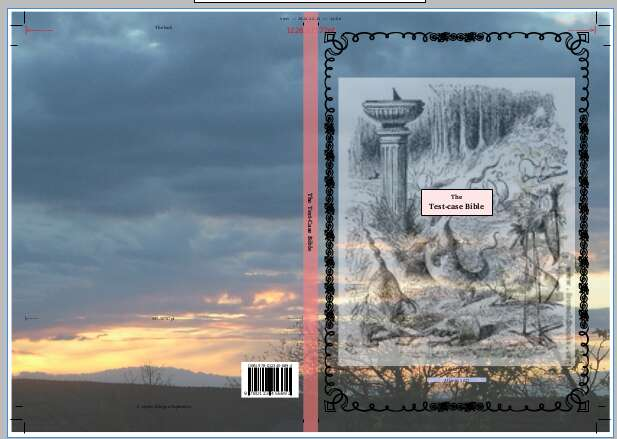
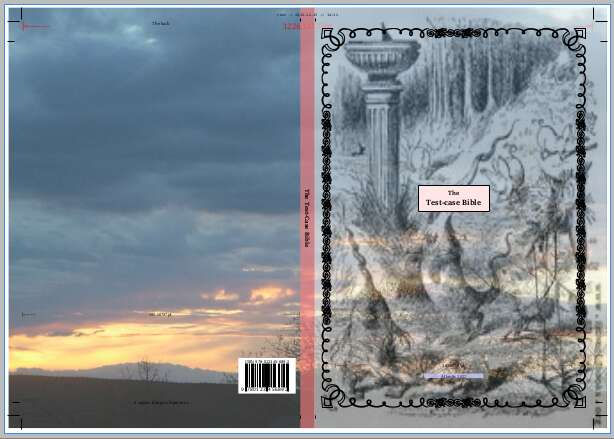
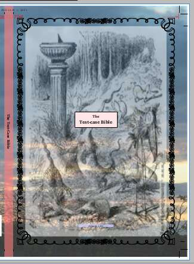
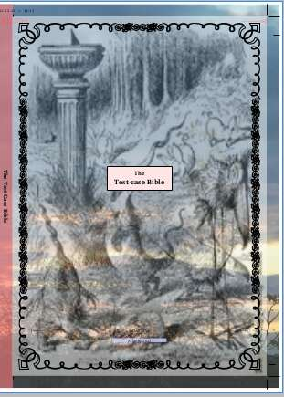
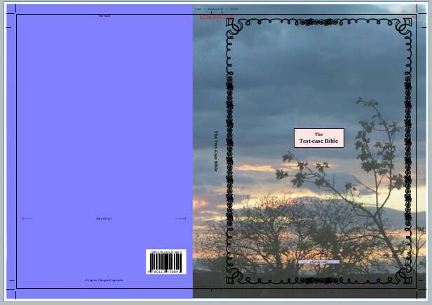
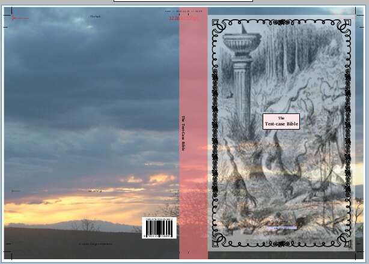
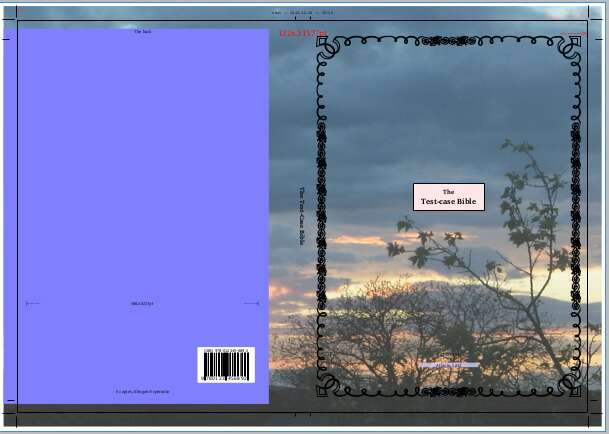

# Covers

## Brief overview

You can (if you try!) mentally divide the wrap-around cover of most  
books into four conceptual pieces:
* A background colour or image that wraps around everything.
* The front of the book
* The back of the book
* The spine

Each of them might have a full or inset picture or solid background, and it might also have a border.

PTXprint gives you the ability to define each of these four elements. The whole
cover is the background for everything, then the front, back and (optionally) spine are put on
top of that, possibly with their own (solid or transparent) backgrounds, and on top of that come
any borders and text that has been defined.

The four elements are defined as sidebars, using the normal sidebar styling options, and their
contents are defined using `\periph` elements. As sidebars may contain other sidebars, which may themselves have borders, background colours, and so on, the potential designs are quite significant.

The GUI gives access to all of these settings, however the documentation below
concentrates on the configuration files that it generates.


## General principles
The cover-generating macro (\\m@kecover) arranges four sidebars to make the cover:
1. The whole cover : `coverwhole`
2. The back cover : `coverback`
3. The spine : `coverspine`
4. The front cover : `coverfront`

The front, spine and back are laid up (on top of the `coverwhole` sidebar) in 
a sequence determined by the boolean `\ifBookOpensLeft`.

The contents are drawn from periphery sections of the same names. If there is no `coverspine` 
periphery or `coverfront` peripery, then the two USFM-3.0 periphery
sections:`spine` and `cover` will be used instead.

An sample cover might have contents such as this (which is cut down from a
test-file): 
```tex
\periph front|coverfront
\zgap|0pt plus 1fill\*
\esb \cat TitleBox\cat*
\mt3 The 
\mt1 Test-case Bible
\esbe
\zgap| 0pt plus 1fill\*
\esb \cat footbox\cat*
\pc \sc Atlantis\sc* 2022
\p
\esbe
\p ~

\periph spine|coverspine
\pc The Test-Case Bible
\p

\periph back|coverback
\pc Test-Case
\zgap| 0pt plus 1fill\*
\esb \cat ISBNbox\cat*
\pc \zISBNbarcode|isbn="978-012345-689-2" height="normal"\*
\esbe
\pc 0 copies, Klingon-Esperanto
\b
```

Each sidebar may have the normal array  normal sidebar foreground and
background images and colours which may be defined (but clearly, not all options or 
combinations make sense). Styling is discussed futher down, and this document
ends with a complete stylesheet that could be used to set the above text.

Note that by default the barcode for the ISBN uses the font Andika. 
This can be changed: (`\def\ISBNfont{Helvetica}`)

## TeX Parameters

```tex
\edef\figbleed{5pt} % Bleed dimension for  figures.
\expandafter\edef\csname cover-bleed\endcsname{3mm}   % Bleed dimension for background colours
\expandafter\edef\csname cover-spine\endcsname{11.23mm}   % Actual spine width = book thickness, endpapers, board thickness, etc.
\expandafter\edef\csname cover-y\endcsname{21cm} % spine/book height 
\expandafter\edef\csname cover-x\endcsname{14.85cm} % Front/back cover
\expandafter\edef\csname cover-back-spinewrap\endcsname{0mm} %  Should the graphic/colour on the spine be given extra space?
\expandafter\edef\csname cover-front-spinewrap\endcsname{0mm} % 
```

The first four TeX values above determine the physical shape and size of the
cover. 
The final two allow the spine colour / image to wrap onto the
front / rear cover as is seen in some editions. 

## Position of the main sidebars
For the cover macro to function as expected, the sidebars must each have their position set to the value set for them in ptx2pdf.sty:
```tex
\Position Fcf
```
(**F**ull page, **c**entered horizontally, and stretched to the **f**ull height vertically)
So far, this value cannot be set using the GUI, so the position should **not** be altered.

## Sizing of Background Images
Of particular relevance for covers, as well as the 1x1 (X x Y) scaling factors,
the `\BgImageScaleTo` stylesheet parameter can take a prefix indicating *what*
the image should be scaled to. (Note that these are so-far untested on other
sidebars). 

The relevant options are:
* bleed - overflow the page into the cropped area by at most `\figbleed`. (If there is no bleed, there is no figure bleed either).
* colbleed - overflow the page into the cropped area as much as the colours do (normally, figures bleed less).
* box - the coloured box
* border - the outer edge of the border
* outer - the outermost of the coloured box or the border.
* inner - The area that text could cover (vertically this extends to the inner edge of the border)
* text - The area that text covers (vertically this extends to the height of the text, excluding stretch, and it is probably not useful for covers).

### Examples
```
\BgImageScaleTo inner
\BgImageScale 1
```
Preserving the orginal aspect ratio, fit the image the the width of the `inner` box:



```
\BgImageScaleTo bleed
\BgImageScale 1x1
```
Ignoring the original aspect ratio, fit the image to the `bleed` box:



```
\BgImageScaleTo inner
\BgImageScale 1x1
```
Ignoring the original aspect ratio, fit the image to the `inner` box:



```
\BgImageScaleTo outer
\BgImageScale 1x1
```
Ignoring the original aspect ratio, fit the image to the `outer` box:



## Special Formatting 
### Wrapped spine:
The revised Cornilescu Bible, (EDCR 2019, Societatea Biblică Interconfesională
din România,  ISBN 978-606-8279-63-3) has a solid background on the front and
spine that wraps approx 2cm onto the back cover, where a contrasting colour
provides a background for the majority of the rear cover.
To set up a similar cover, the `coverfront`, `coverspine` and `coverback` could have 
appropriate background colours set and the parameter `cover-back-spinewrap`
could be defined to `2cm`.
Alternatively, a large cover image could have the back-page portion of it masked off, 
as in the first figure below. The second shows a semi-transparent red spine wrapped
towards the front.  Notice how the front cover's border and background image are 
shrunk horizontally by this.






### Upper/Lower band: BoxPadding for coverwhole.
Testing demonstrated a strange effect came about from setting the `BoxTPadding` and `BoxBPadding` 
style parameters the `coverwhole`, sidebar, where the covers were pushed off the page. This 
has been embraced as a (probably rarely used) feature: if these padding values are set 
to `>=1pt` then the upper and/or lower bleed is turned off for the other 3 sidebars, 
and background colour for the upper and lower edges will be set by the `coverwhole` sidebar.
Note that nothing from these sidebars should be able to reach into this area.




## Complete style file
The images in this document have almost all been generated using minor
variations on the stylesheet below.
Note the use of the short-hand `\Category` which sets an internal prefix that
is applied to later style definitions. I.e. `\Marker pc` after `\Category coverwhole` 
is actually styling `\Marker cat:coverwhole|pc`
In a manually generated file, `\BgImageScaleTo` and `\BgImageScale` can be conflated as below,
this use is deprecated, however, as the GUI may not interpret it correctly.

```tex
\Category coverfront
\BorderStyle Vectorian3
\BoxBPadding 30
\BorderWidth 24
\BoxVPadding 45
\BoxHPadding 45
\Alpha 0.6
\BgColour F
%\BgImageLow F
\BgImage SlithyToves.jpg
\BgImageAlpha 0.5
%\BgImageOversize distort
\BorderHPadding -40
\BorderVPadding -40
\BgImageScale inner|x0.8
\Border All

\Category coverback
\Alpha 1
\BgColour T
\BorderStyle double
\BorderFillColour None
\BorderLineWidth 0.5
\BorderPadding -15
%\BoxPadding 20
%\BoxLPadding 5
\BorderWidth 5
\BoxTPadding 2
\BoxHPadding 20
\BoxBPadding 10
\Border None 

\Category coverwhole
%\SpaceBefore 10
%\BoxLPadding 30
%\BorderTPadding -30
\BgImage Background.jpg
\BgImageScale bleed|1.0x1
\BorderWidth 1.0
\BgColour F
\BgImageAlpha 0.8
\BoxVPadding 0
\Border None
\Border All 

\Marker pc
\Color xff0000
\FontSize 24

\Marker p
\Color xff0000

\Category coverspine
\Border None
\Alpha 0.6
\BgColour F
\Rotation r

\Marker pc
\FontSize 16
\Bold

\Category TitleBox
\Position hc
\Scale 0.3
\SpaceBefore 10
\SpaceAfter 20
\BgColour 1.0 0.9 0.9
\Border All
\BoxPadding 0
\BoxBPadding 10
\Alpha 1

\Category ISBNbox
\Position hr
\SpaceBefore 100
\SpaceAfter 0
\Border None
\BorderWidth 0
\BgColour 1 1 1
\BoxHPadding 5
\BoxVPadding 5
\BorderRPadding 10
\Scale 0.7
\Alpha 1

\Category footbox
\Position h
\SpaceBefore 10
\SpaceAfter 10
\Scale 0.25
%\Border All
\BgColour 0.8 0.8 1
%\BoxHPadding 0
%\BoxVPadding 0
%\BorderPadding 1
%\Scale 0.3
\Alpha 0.8

```


