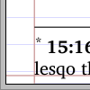
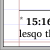
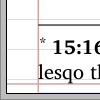
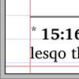
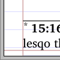

# Enhanced control of footnotes
There are some flags that control the exact placement of paragraphed footnotes relative to other page elements. This is the beginning of an attempt to document them.

|  | gr, !gl | gr, gl  | !gr, !gl | !gr,gl |
|--|--|--|--|--|
| kdp |    |   |    |   |
| !kdp |    |   |    |   |

Key to the above table:

|Abbreviation | Option|
|--|--|
| kdp | `\parnoteskilldepthtrue` - Remove depth after paragraphed notes|
| !kdp | `\parnoteskilldepthfalse` |
| gr	| `\parnotesruletopskiptrue`  - Use grid (linespacing) not font/glyph height at rule|
| !gr	| `\parnotesruletopskipfalse`  |
| gl	| `\FootNoteGlyphMetricstrue` - Use glyph height not font height in footnotes |
| !gl | `\FootNoteGlyphMetricsfalse`| 

The defaults (!gl, !gr, !kdp) are selected to correspond to the old-style footnotes, however as can be seen in the images, they can result in the largest possible amount of whitespace around the notes, as they obey the full ascent and descent of the font, which can be excessive on some fonts.

For the most consistent results when a variety of fonts is in use, (for example in a study bible where notes use different categories which may affect the fonts from one page to another), it is highly recommended to remove all font-based changes: Use the grid (linespacing) at the rule, and remove depth after paragraphed notes.

If depth is not removed, then it is normally a good idea to avoid the use of glyph metrics, otherwise the footnote moves up and down on the page depending whether the last line of the note has descenders or not.